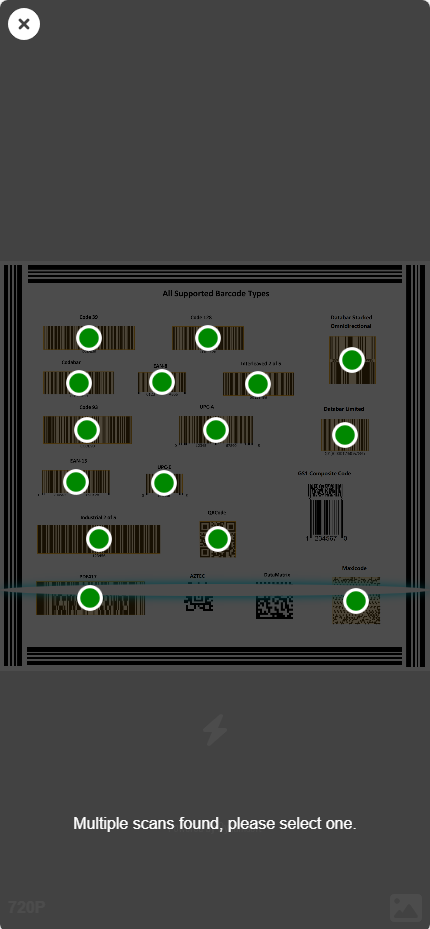
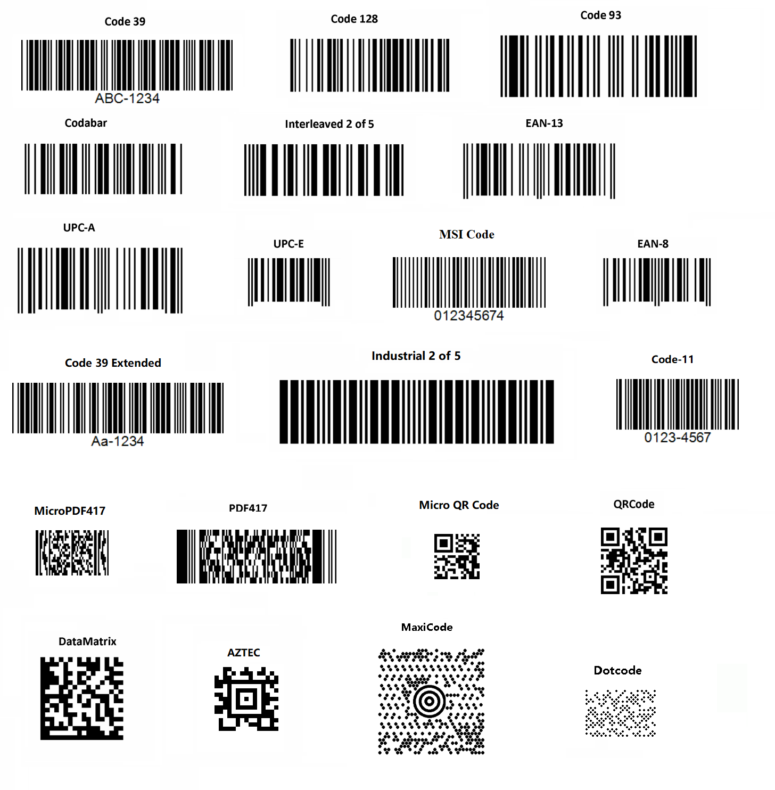

# Easy Barcode Scanner

The Easy Barcode Scanner is a lightweight, user-friendly wrapper for the Dynamsoft Barcode Reader SDK. It simplifies the barcode scanning process, making it easier to integrate into your web applications with minimal effort.

**Features**
* Supports video-based barcode scanning
* Handles multiple barcodes with ease
* Simple integration with just a few lines of code

## Out-of-the-box Scanning

The simplest way to use Easy Barcode Scanner requires only one line code to create a video decoding web application.

```html
<button id="btn-scan">scan</button>
<script src="https://cdn.jsdelivr.net/npm/dynamsoft-barcode-reader-bundle@10.2.1000/dist/dbr.bundle.js"></script>
<script src="https://cdn.jsdelivr.net/gh/Keillion/easy-barcode-scanner@10.2.1004/dist/easy-barcode-scanner.js" data-license=""></script>
<script>
  document.getElementById('btn-scan').addEventListener('click',async()=>{
    alert(await EasyBarcodeScanner.scan());
  });
</script>
```



## Create Your Own Scanner for Further Control

You can also create your own scanner instance to have more control over the entire workflow. For more details on the encapsulated functionality, refer to `src/index.ts`, and feel free to modify it based on your specific needs.

```html
<button id="btn-scan">scan</button>
<script src="https://cdn.jsdelivr.net/npm/dynamsoft-barcode-reader-bundle@10.2.1000/dist/dbr.bundle.js"></script>
<script src="https://cdn.jsdelivr.net/gh/Keillion/easy-barcode-scanner@10.2.1004/dist/easy-barcode-scanner.js" data-license=""></script>
<script>
  let pScanner, scanner;
  document.getElementById('btn-scan').addEventListener('click',async()=>{
    scanner = await (pScanner || (pScanner = EasyBarcodeScanner.createInstance()));
    scanner.onUniqueRead = (txt) => { console.log(txt); };
    await scanner.open();
  });
</script>
```

## How to use it in frameworks

To integrate Easy Barcode Scanner into your framework, follow these steps:

1. Install the necessary package:

```sh
npm i dynamsoft-barcode-reader-bundle@10.2.1000 -E
```

2. Copy the `src/index.ts` file from the library into your project. Rename it as needed, for example: `[your-path]/easy-barcode-reader.ts.`

3. Import `dynamsoft.config.ts` into project entry point(like `main.ts`):

```ts
import EasyBarcodeScanner from '[your-path]/easy-barcode-reader';

EasyBarcodeScanner.license = ""; // Add your license key here
```

**Example 1: Simple One-Click Scan**
For a simpler implementation, this example shows how to scan with a single function:

```ts
import EasyBarcodeScanner from '[your-path]/easy-barcode-reader';

async scan(){
    alert(await EasyBarcodeScanner.scan()); // Display scanned result
}
```

**Example 2: Setting Up a Scanner**
This example demonstrates how to create a scanner instance and handle barcode readings efficiently:

```ts
import EasyBarcodeScanner from '[your-path]/easy-barcode-reader';

let pScanner = null;
let scanner = null;

async mount(){
    scanner = await (pScanner || (pScanner = EasyBarcodeScanner.createInstance()));
    scanner.onUniqueRead = (txt) => { console.log(txt); };
    await scanner.open();
}
beforeUnmount(){
    (await pScanner)?.dispose();  // Clean up to free resources
}
```

* The `mount()` function initializes the scanner and listens for barcode readings.
* The `beforeUnmount()` function disposes of the scanner instance to prevent memory leaks.

## Customize the UI

The built-in UIs are located in files like `dce.ui.html`. You can copy `dce.ui.html` into your project, modify it as needed, and pass its path to the `createInstance` or `scan` API to use the customized version.

```typescript
// use 'https://cdn.jsdelivr.net/npm/dynamsoft-camera-enhancer@4.0.3/dist/dce.ui.html' by default
EasyBarcodeScanner.createInstance(ui?: string|HTMLElement);
// use 'https://cdn.jsdelivr.net/gh/Keillion/easy-barcode-scanner@10.2.1004/dce.ui.html' by default
EasyBarcodeScanner.scan(ui?: string|HTMLElement);
```

Please refer to [customize the UI of CameraEnhancer](https://www.dynamsoft.com/camera-enhancer/docs/web/programming/javascript/user-guide/index.html#customize-the-ui) for more details.

## All supported barcodes

You can use the code snippet from the[Out-of-the-box Scanning](#out-of-the-box-scanning) section to focus the camera on one or more barcodes. If only one barcode is detected, the result will be displayed immediately. If multiple codes are scanned, an additional interactive step allows you to choose the target.



> Please note that some barcode types are not supported by default for performance concern. Please check [here](https://www.dynamsoft.com/barcode-reader/docs/web/programming/javascript/user-guide/index.html#customize-the-process) to change settings.

## License Information

The license used in this sample is an automatically requested trial license, only valid for 24 hours and applicable to any newly authorized browser. To test the SDK further, you can request a 30-day free trial license via the <a href="https://www.dynamsoft.com/customer/license/trialLicense?ver=10.2.10&utm_source=sampleReadme&product=dbr&package=js" target="_blank">Request a Trial License</a> link.

The license can be directly configured within the script tag when including the script file.

```html
<script src="https://cdn.jsdelivr.net/gh/Keillion/easy-barcode-scanner@10.2.1004/dist/easy-barcode-scanner.js" data-license="[YOUR-LICENSE]"></script>
```
